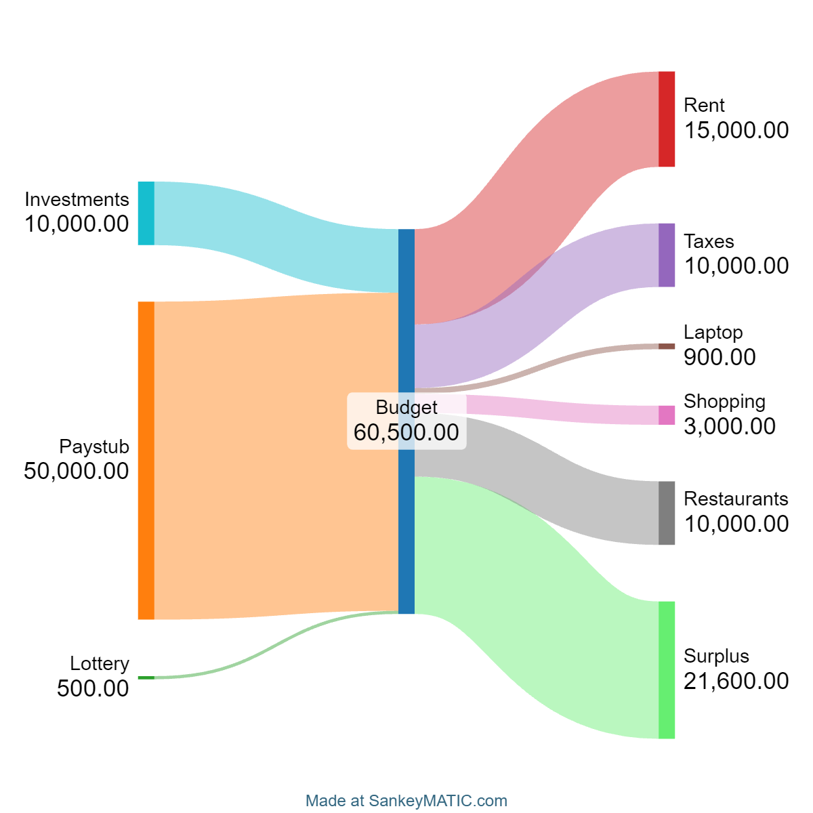

# Spring API for my user-friendly Sankey generator.

To generate the diagram, it will scrape SankeyMatic's static page with puppeteer.js. 

# Setup
Install dependencies:
```sh
npm install
```

Run Spring Boot Application:
```sh
mvn spring-boot:run
```

# Usage
```sh
POST localhost:8080/build
```
Use Form-Data with the following data:
```sh
incomes | 10000,50000,500
ilabels | Investments,Paystub,Lottery
outputs | 15000,10000,900,3000,10000
olabels | Rent,Taxes,Laptop,Shopping,Restaurants
```
Here is the example generated:

